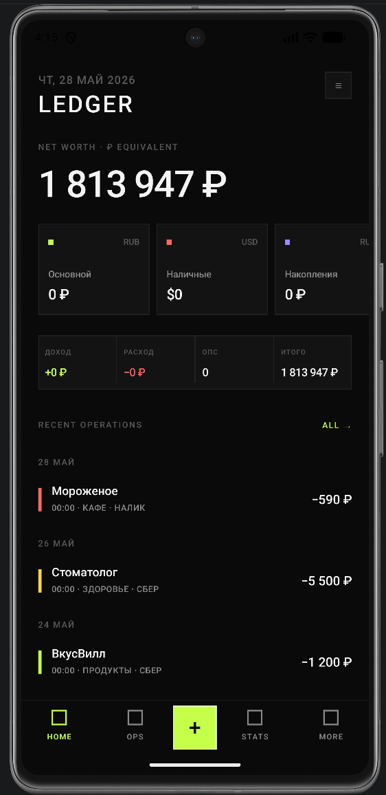
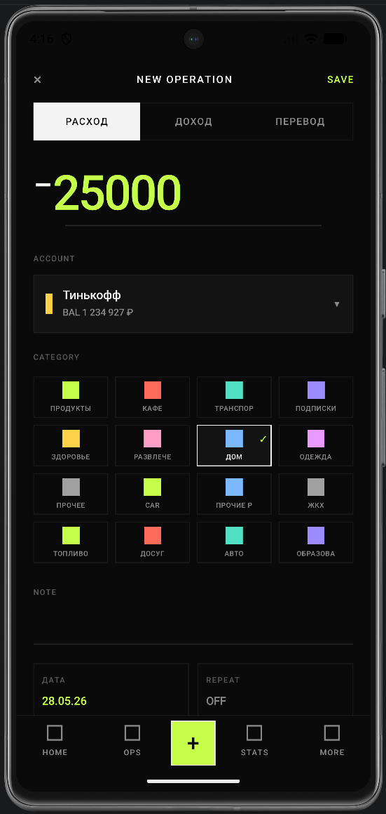
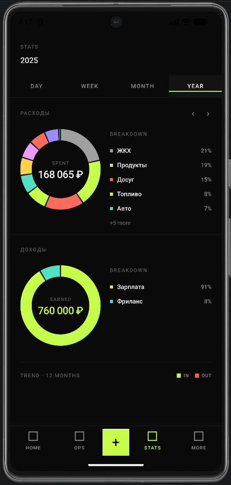
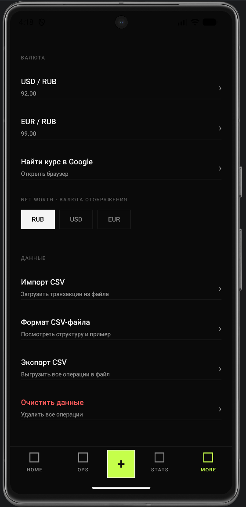

# Ledger — Personal Finance Tracker

A minimalist personal finance app for Android, built with Jetpack Compose. Track expenses, income, and transfers across multiple accounts with category budgets, recurring transactions, statistics, and optional PIN/biometric lock.

---

## Features

- **Transactions** — expense, income, transfer; search and filter by date
- **Accounts** — multiple accounts with balance tracking and sparkline history
- **Categories** — custom categories with 64-color palette, budget limits, and deletion
- **Statistics**
  - Expense donut chart with per-category breakdown
  - Income donut chart with per-category breakdown
  - 12-month stacked bar trend (income + expense)
  - 30-day activity heatmap
  - Period navigation: Day / Week / Month / Year with ‹ › buttons and swipe gesture
- **CSV Import** — bulk-import transactions from a CSV file (see format below)
- **CSV Export** — export all transactions to a CSV file via the system file picker
- **Recurring transactions** — daily / weekly / monthly / yearly templates via WorkManager
- **Security** — 4-digit PIN with SHA-256 hashing, optional biometric (fingerprint / face) unlock
- **Themes** — dark and light theme, toggleable at runtime
- **Offline-first** — all data stored locally in Room (SQLite); no network required

---

## Screenshots

<table>
  <tr>
    <td align="center"><br/><sub>Home</sub></td>
    <td align="center"><br/><sub>Add transaction</sub></td>
    <td align="center"><br/><sub>Statistics</sub></td>
    <td align="center"><br/><sub>Settings</sub></td>
  </tr>
</table>

---

## CSV Format

The app imports and exports a UTF-8 CSV with the following columns:

| Column | Description | Example |
|--------|-------------|---------|
| `uid` | Unique transaction ID (any string) | `tx-001` |
| `date` | ISO date `YYYY-MM-DD` | `2025-03-15` |
| `amount` | Positive decimal | `4500.00` |
| `type` | `income`, `expense`, or `transfer` | `expense` |
| `account` | Account name (created if missing) | `Тинькофф` |
| `to_account` | Destination account for transfers | `Сбер` |
| `category` | Category name (created if missing) | `Продукты` |
| `note` | Free-text note | `Пятёрочка` |

A sample two-year dataset with realistic Russian household transactions is provided in [`csv/demo_2years.csv`](csv/demo_2years.csv).

---

## Tech Stack

| Layer | Technology |
|-------|-----------|
| UI | Jetpack Compose + Material3 |
| Architecture | MVVM + Repository |
| Database | Room 2.6 (SQLite) |
| Async | Kotlin Coroutines + Flow |
| Navigation | Navigation Compose |
| Background work | WorkManager (CoroutineWorker) |
| Preferences | Jetpack DataStore |
| Security | AndroidX Biometric + SHA-256 |
| Fonts | IBM Plex Mono, IBM Plex Sans (Google Fonts) |
| Min SDK | 26 (Android 8.0) |
| Target SDK | 35 (Android 15) |
| Language | Kotlin 2.0 / JVM 17 |

---

## Project Structure

```
app/src/main/java/com/ledger/app/
│
├── LedgerApplication.kt          # Application class — DI root, repo init, WorkManager
├── MainActivity.kt               # Single activity; splash, theme, PIN gate, file picker
│
├── domain/model/                 # Pure Kotlin data classes — no Android deps
│   ├── Account.kt
│   ├── Category.kt
│   ├── Transaction.kt
│   └── RecurringConfig.kt
│
├── data/
│   ├── db/
│   │   ├── LedgerDatabase.kt     # Room database (version 2)
│   │   ├── entity/               # Room @Entity classes + toDomain() / fromDomain()
│   │   └── dao/                  # @Dao interfaces (queries, aggregates)
│   ├── repository/               # Repository layer; wraps DAOs, exposes Flow / suspend
│   ├── CsvImporter.kt            # CSV parser — upserts accounts, categories, transactions
│   └── prefs/
│       └── PrefsManager.kt       # DataStore — theme, exchange rates, net-worth currency
│
├── security/
│   └── SecurityManager.kt        # PIN hash storage + biometric flag (DataStore)
│
├── worker/
│   ├── RecurringTransactionWorker.kt  # Daily CoroutineWorker — fires due recurring templates
│   └── BootReceiver.kt               # Re-registers WorkManager after device reboot
│
├── util/
│   ├── Extensions.kt             # LocalDate / LocalTime / Double formatting helpers
│   └── DefaultData.kt            # Seed accounts and categories on first launch
│
└── ui/
    ├── theme/                    # LedgerColors, LedgerTheme, IBM Plex font families
    ├── components/               # Shared composables
    │   ├── AmountDisplay.kt      # BigAmountDisplay — large inline amount input
    │   ├── TransactionRow.kt     # Single transaction list item
    │   ├── BottomNav.kt          # LedgerBottomNav + NavTab sealed class
    │   ├── AccountDialog.kt      # Account add/edit dialog + ColorPickerRow (64 colors)
    │   ├── DonutChart.kt         # Segmented donut (Canvas)
    │   ├── BarChart.kt           # StackedBarChart — 12-month income/expense trend
    │   ├── SparklineChart.kt     # Mini sparkline for account chips
    │   ├── HeatmapGrid.kt        # 30-day activity heatmap grid
    │   └── SectionHeader.kt
    ├── navigation/
    │   └── NavGraph.kt           # LedgerNavHost + Routes constants
    └── screen/
        ├── home/                 # Dashboard — net worth, today summary, recent ops
        ├── transactions/         # Full transaction list with search
        ├── add/                  # Add / edit transaction form
        ├── detail/               # Transaction detail + delete / duplicate
        ├── accounts/             # Account list with net worth and quick stats
        ├── categories/           # Category list with budget bars and deletion
        ├── stats/                # Statistics — donuts, bar chart, heatmap, period nav
        ├── pin/                  # PIN entry + setup (VERIFY / SET / CONFIRM modes)
        └── settings/             # Theme, PIN, biometric, CSV import/export, data reset
```

---

## Building the App

### Prerequisites

| Tool | Version |
|------|---------|
| Android Studio | Hedgehog (2023.1.1) or newer |
| JDK | 17 (bundled with Android Studio) |
| Android SDK | API 35 (installed via SDK Manager) |
| Kotlin | 2.0.21 (managed by Gradle) |

### Steps

1. **Clone the repository**
   ```bash
   git clone https://github.com/<your-username>/ledger-app.git
   cd ledger-app
   ```

2. **Open in Android Studio**
   - Launch Android Studio → **File → Open** → select the `ledger-app` folder
   - Wait for Gradle sync to complete (first sync downloads ~300 MB of dependencies)

3. **Run on a device or emulator**
   - Connect a physical device with USB debugging enabled, **or** create an AVD via **Device Manager** (API 26+, recommended API 35)
   - Press **Run ▶** or `Shift+F10`

4. **Build a release APK**
   ```bash
   ./gradlew assembleRelease
   ```
   Output: `app/build/outputs/apk/release/app-release-unsigned.apk`

   To sign the APK, add a keystore configuration to `app/build.gradle.kts`:
   ```kotlin
   signingConfigs {
       create("release") {
           storeFile = file("keystore.jks")
           storePassword = System.getenv("KEYSTORE_PASS")
           keyAlias = System.getenv("KEY_ALIAS")
           keyPassword = System.getenv("KEY_PASS")
       }
   }
   ```

---

## Running Tests

### Unit tests
```bash
./gradlew test
```

### Instrumented tests (requires connected device / emulator)
```bash
./gradlew connectedAndroidTest
```

### Lint
```bash
./gradlew lint
```
Report is written to `app/build/reports/lint-results-debug.html`.

---

## Architecture

```
UI (Compose Screens)
       │  collectAsStateWithLifecycle()
       ▼
  ViewModel  ──────────────────────────────────────────────┐
       │  viewModelScope.launch / .collect                  │
       ▼                                                    │
  Repository  ◄──── Flow<List<T>> / suspend fun            │
       │                                                    │
       ▼                                                    │
    Room DAO                                        DataStore / SecurityManager
       │
       ▼
   SQLite (local)
```

- **No dependency injection framework** — `LedgerApplication` holds lazy-initialised repositories; ViewModels cast `application as LedgerApplication`.
- **Single Activity** — `MainActivity` hosts the Compose `NavHost`; all screens are composables.
- **Unidirectional data flow** — every screen observes a `StateFlow<UiState>` from its ViewModel; user events call ViewModel methods.

---

## Database Schema

| Table | Key columns |
|-------|-------------|
| `accounts` | `id`, `name`, `type`, `balance`, `currency`, `color`, `isActive` |
| `categories` | `id`, `name`, `type` (EXPENSE/INCOME), `color`, `budget` |
| `transactions` | `id`, `amount`, `type`, `categoryId`, `accountId`, `toAccountId`, `dateEpochDay`, `timeMinuteOfDay`, `note` |
| `recurring_configs` | `id`, template fields mirroring transactions, `interval`, `intervalCount`, `nextDateEpochDay`, `isActive` |

Room database version: **2**. `fallbackToDestructiveMigration()` is enabled — reinstalling resets the database.

---

## Security

- PIN is hashed with **SHA-256** before storage; the raw PIN is never persisted.
- Biometric authentication uses `androidx.biometric.BiometricPrompt` via `FragmentActivity`.
- Both PIN hash and biometric flag are stored in a separate **DataStore** file (`security_prefs`) isolated from general app preferences.

---

## Contributing

1. Fork the repository and create a feature branch: `git checkout -b feature/your-feature`
2. Commit your changes following [Conventional Commits](https://www.conventionalcommits.org/): `feat:`, `fix:`, `refactor:`, etc.
3. Open a pull request describing what changed and why.

---

## License

```
MIT License

Copyright (c) 2026 Expl0i

Permission is hereby granted, free of charge, to any person obtaining a copy
of this software and associated documentation files (the "Software"), to deal
in the Software without restriction, including without limitation the rights
to use, copy, modify, merge, publish, distribute, sublicense, and/or sell
copies of the Software, and to permit persons to whom the Software is
furnished to do so, subject to the following conditions:

The above copyright notice and this permission notice shall be included in all
copies or substantial portions of the Software.

THE SOFTWARE IS PROVIDED "AS IS", WITHOUT WARRANTY OF ANY KIND, EXPRESS OR
IMPLIED, INCLUDING BUT NOT LIMITED TO THE WARRANTIES OF MERCHANTABILITY,
FITNESS FOR A PARTICULAR PURPOSE AND NONINFRINGEMENT. IN NO EVENT SHALL THE
AUTHORS OR COPYRIGHT HOLDERS BE LIABLE FOR ANY CLAIM, DAMAGES OR OTHER
LIABILITY, WHETHER IN AN ACTION OF CONTRACT, TORT OR OTHERWISE, ARISING FROM,
OUT OF OR IN CONNECTION WITH THE SOFTWARE OR THE USE OR OTHER DEALINGS IN THE
SOFTWARE.
```
